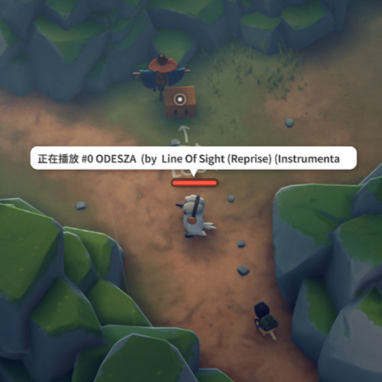

# 自定义音乐耳机

###  ✅ 已完成

#### [本项目已在github开源：leaf3woods/duckov-modyes](https://github.com/leaf3woods/duckov-modyes)

### 0. 局内效果

<center>
   
</center>


### 💥 更新 💥 
现已支持键盘按键控制耳机音乐的播放

* 按键[上箭头]: 控制播放模式向上选择

* 按键[下箭头]: 控制播放模式向下选择

* 按键[左箭头]: 播放上一曲

* 按键[右箭头]: 播放下一曲

* 按键[右Ctrl]: 切换音乐：播放/暂停

  ***按键有消抖，不支持长按切歌***

  

### 1. 功能说明

* 初次加载会在[游戏exe目录]下自动生成一个MyBGM文件夹，把你喜欢的背景音乐放入该文件夹中
* 如果目录下没有能加载的音乐文件，带上耳机什么都不会发生
* 目前支持：.mp3, .flac, .aac, .m4a 类型的音频文件，放入其他类型的文件会被排除
* 将耳机带上耳机装备插槽，音乐即开始播放，摘下耳机音乐即播放停止
* 场景中有敌对鸭发出声音，即暂停音乐播放，脱离战斗音乐恢复
* 启用此MOD后, 初次进入基地会在快递站放入一件音乐耳机
* 声音设置，目前绑定到主音量和音乐音量，加载场景前会获取已配置的音量

### ~~2. 已知问题~~

- [x] ~~进入场景，需要重新佩戴一次才能播放~~
- [x] ~~敌人在附近时音乐反复暂停~~
- [x] ~~无法切歌和切换播放模式~~

### 3. 使用说明

1. 创意工坊用户，点击订阅即可

2. 若要手动安装，可以把本仓库 [release文件]([Releases · leaf3woods/duckov-modyes](https://github.com/leaf3woods/duckov-modyes/releases))下载后解压到：[游戏exe目录]\Duckov_Data\Mods\ 文件夹下：
   
   ```
   [游戏exe目录]\Duckov_Data\Mods\
   ├─modyes-custom-basebgm
   │      0Harmony.dll
   │      BepInEx.dll
   │      info.ini
   │      Modding.Core.dll
   │      Modding.MusicEarphone.dll
   │      preview.png
   │
   └─...其他Mod文件夹
   ```

3. 若要使用BepInEX安装，请把本仓库 [release文件]([Releases · leaf3woods/duckov-modyes](https://github.com/leaf3woods/duckov-modyes/releases))下载后解压到：[游戏exe目录]\BepInEx\plugins\ 的文件夹下：

```
[游戏exe目录]\BepInEx\plugins\
│  LogOutput.log
├─...bepinex其他文件
├─cache
└─plugins
    ├─.disabled
    ├─modyes-custom-musicearphone
    │      0Harmony.dll
    │      BepInEx.dll
    │      info.ini
    │      Modding.Core.dll
    │      Modding.MusicEarphone.dll
    │      preview.png
    │
    ├─...其他bepinex加载的mod文件夹
```


### 4. 开源项目

[GitHub - pardeike/Harmony: A library for patching, replacing and decorating .NET and Mono methods during runtime](https://github.com/pardeike/Harmony)

[GitHub - BepInEx/BepInEx: Unity / XNA game patcher and plugin framework](https://github.com/BepInEx/BepInEx)

